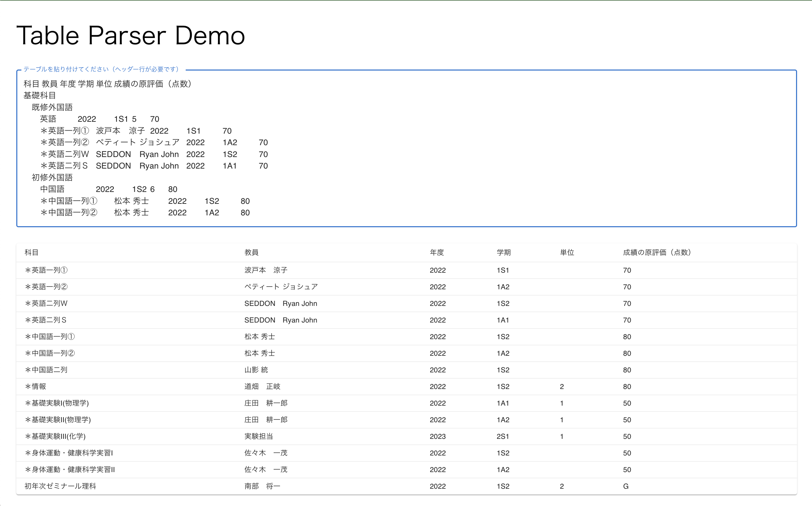

# Table Parser

## 概要

UTAS の成績表をコピペすることで情報を取得するツールです.

## セットアップ

```bash
yarn install
yarn start
```

## 使い方

1. [UTAS の原評価閲覧ページ](https://utas.adm.u-tokyo.ac.jp/campusweb/campusportal.do?page=main&tabId=si) の表をコピーする (ヘッダー行を含む)

2. [起動したアプリケーション](http://localhost:3000) の入力ボックスにペーストする

3. 点数・合否を含む行のみが表示される

## サンプル入力

```plain
科目	教員	年度	学期	単位	成績の原評価（点数）
基礎科目
　既修外国語
　　英語		2022	1S1	5	70
　　＊英語一列①	波戸本　涼子	2022	1S1		70
　　＊英語一列②	ペティート ジョシュア	2022	1A2		70
　　＊英語二列Ｗ	SEDDON　Ryan John	2022	1S2		70
　　＊英語二列Ｓ	SEDDON　Ryan John	2022	1A1		70
　初修外国語
　　中国語		2022	1S2	6	80
　　＊中国語一列①	松本 秀士	2022	1S2		80
　　＊中国語一列②	松本 秀士	2022	1A2		80
　　＊中国語二列	山影 統	2022	1S2		80
　情報
　　＊情報	道畑　正岐	2022	1S2	2	80
　基礎実験
　　＊基礎実験Ⅰ(物理学)	庄田　耕一郎	2022	1A1	1	50
　　＊基礎実験Ⅱ(物理学)	庄田　耕一郎	2022	1A2	1	50
　　＊基礎実験Ⅲ(化学)	実験担当	2023	2S1	1	50
　身体運動・健康科学実習		2022	1S2	2	50
　　＊身体運動・健康科学実習Ⅰ	佐々木　一茂	2022	1S2		50
　　＊身体運動・健康科学実習Ⅱ	佐々木　一茂	2022	1A2		50
　初年次ゼミナール理科
　　　初年次ゼミナール理科	南部　将一	2022	1S2	2	G
```


